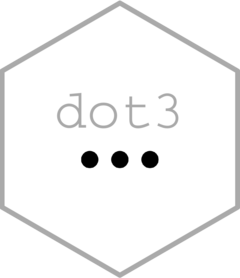

<!-- README.md is generated from README.Rmd. Please edit that file -->

```{r, include = FALSE}
knitr::opts_chunk$set(
  collapse = TRUE,
  comment = "#>",
  fig.path = "man/figures/README-",
  out.width = "100%"
)
```

# dot3 

<!-- badges: start -->
[](https://lifecycle.r-lib.org/articles/stages.html#experimental)
<!-- badges: end -->

{dot3} provides tools to manipulate the ellipsis object, also known as dots (`...`).

## Installation

Install with:

``` r
devtools::install_github("moodymudskipper/dot3")
```

## Context: understanding dots

The ellipsis `...` in R is a special kind of object. It has the type `"..."`
(you can see it enumerated in the different base types in `?typeof`)
and cannot be manipulated like other objects.

```{r, error = TRUE}
# This doesn't work
f <- function(...) ...
d <- f(a=1)

# but this does
f <- function(...) get("...")
d <- f(a=1)

# printing it doesn't say much
d
typeof(d)
```

Though it's not typically done, and is hard to do without having R complain,
we can manipulate these objects

```{r}
with(list(... = d), data.frame(..., b=2))
```

Arguments defined through dots are defined lazily (only evaled when needed),
each of them has 3 important properties :

* a name (optional)
* an expression
* an environment where the expression will be evaled when needed

{dot3} offers tools to easily manipulate dots, this includes:

* creating them
* subsetting them and reordering them
* renaming their dot arguments
* setting evaluation environments
* combining them
* evaluating a dot argument selectively

## Create and manipulate "dots" objects

We can create "dots" objects with the `dots()` function. 

```{r}
library(dot3)
dots1 <- dots(a=x, x+y)
```

The evaluation environment of these dot args will be the local environment,
if we need to set another environment we can use `dots_in_env()`

We can use `with_dots()` to provide the dots as arguments to a function call.

```{r}
x <- 1
y <- 2
with_dots(dots1, c(...))
```

The above is really equivalent to `with(list(... = dots1), c(...))`, just a bit
more compact and efficient.

Objects created with `dots()` also have a class "dots", that allows printing, subsetting, combining, and naming.

```{r}
dots1 <- dots(a=x, x+y)

# printing displays the argument positions, environments, names (if relevant), and expression 
dots1

# we can subset dots, this includes reordering them
dots1[2:1]

# subsetting with `[[` or `$` evaluates the item in the relevant environment, without
# triggering evaluation of other elements of the "dots" object
dots1$a
dots1[[2]]

# we can use c() to combine
dots2 <- dots(b = y)
dots3 <- c(dots1, dots2)

# we can edit the names
names(dots3)[1] <- "X"
# and the environments
dots_env(dots3[1:2]) <- asNamespace("stats")
dots3
```

In practice `dots()` will mostly be used inside of functions, to manipulate the 
dot arguments originally provided to the function.

```{r}
f <- function(...) {
  dots1 <- dots()
  dots2 <- dots(...) # the same
  dots3 <- dots(b = y)
  dots4 <- dots(..., b = y)
  list(
    dots1 = dots1,
    dots2 = dots2,
    dots3 = dots3,
    dots4 = dots4
  )
}
f(a = x)
```

## Convert arguments to/from dots

`endots()` creates a single argument `"dots"` object from an argument (or any object or
unevaled promise).

`enarg()` creates an unevaled promise from a one argument `"dots"` object,  *as a side effect*.

These names are inspired to the `en*()` family of functions of {rlang} (`enquo()`, `enexpr()` etc).


```{r, error = TRUE}
f <- function(x) {
 dots1 <- endot(x)
 dots1
}
f(y+z)

g <- function(...) {
  d <- dots(...)
  enarg(d[1]) # create promise using name of dot argument
  enarg(d[2], "z") # use provided name instead
  message("not yet evaled")
  x + z
}
g(x = 1, y = 2)
try(g(x = 1, y = stop()))
```

## dots_expand

This function is used to support the syntax `fun(... = alist())`,
see example below :

```{r}
subset2 <- function(...) {
  dots_expand() # the only thing we need is this call before dots are used in the function
  subset(...)
}

# it still works as it would without the feature
subset2(cars, speed == 4)

# we can provide all dot arguments to the `... =` argument
args <- alist(cars, speed == 4)
subset2(... = args)

# or combine both ways
args <- alist(speed == 4)
subset2(cars, ... = args)
```

This way arguments can easily be provided to a function without using `do.call()`,
it can be compared to the use of `!!!` in {rlang}, except that it will work
with lazily evaled arguments too.
